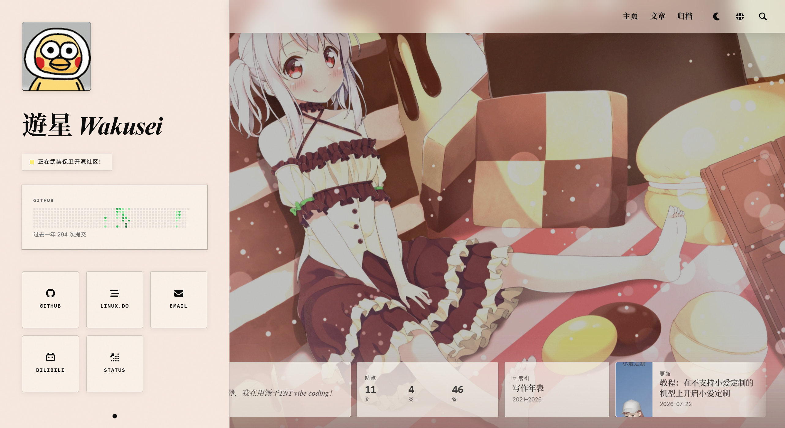

# Wakusei HomePage


基于 **Astro 7 + Vue 3 + Pinia + TypeScript** 的静态个人主页与博客，部署到 Cloudflare Pages（纯静态，无 SSR / Functions）。



## 功能概览

- 持久壳（`SiteShell` / TopBar / Footer）+ Astro View Transitions
- 博客：Content Collections、文章页（TOC / 进度条 / 灯箱 / 代码复制）、归档·分类·标签·搜索
- 明暗主题、zh-CN / en / ja 三语 UI
- 壁纸默认图 + 外部 API 轮换；构建期封面优化（Sharp / WebP）
- RSS / Atom、自动 sitemap、客户端搜索索引
- 首屏直接渲染内容，不使用阻塞式 loading overlay

## 技术栈

| 类别 | 选型 |
|------|------|
| 框架 | Astro 7（`output: 'static'`） |
| UI | Vue 3（`<script setup>` islands）+ Pinia |
| 内容 | Astro Content Collections + Zod（`astro/zod`） |
| 校验 / 类型 | Zod、TypeScript（`astro check`） |
| 样式 | 手写 CSS（`src/styles/*`） |
| 质量 | ESLint、Prettier、Vitest（jsdom） |
| 集成 | `@astrojs/vue`、`@astrojs/sitemap` |

Node `>=22.12.0`，npm `>=9.6.5`。

## 本地开发

```bash
npm install
npm run dev
```

开发地址：`http://localhost:4321`

### 常用命令

```bash
npm run lint
npm run lint:fix
npm run format
npm run format:check
npm test
npm test -- tests/foo.test.ts   # 单文件
npm run check                   # astro check
npm run build                   # → dist/
npm run serve                   # 预览 dist/
npm run preview                 # astro preview
```

完整验证（与 CI 一致，`.github/workflows/ci.yml`，Node 22.12.0）：

```bash
npm run lint
npm run format:check
npm test
npm run check
npm run build
```

## 部署

Cloudflare Pages（静态站点）：

| 项 | 值 |
|----|-----|
| 构建命令 | `npm run build` |
| 输出目录 | `dist` |
| 环境 | Node 22.12+ 推荐 |

不依赖 Astro SSR、Cloudflare Functions 或后端服务。

## 配置

日常改文案 / 链接 / 颜色 / 壁纸 / 导航：只编辑 **`src/data/customize.ts`**。

```
customize.ts  →  site.ts（Zod：schema.ts）  →  siteConfig
```

- 新增配置字段：同步改 `src/types/site.ts`、`src/data/schema.ts`、`customize.ts`
- UI 翻译：`src/data/i18n.ts`（与 `customize.ts` 的 `i18n.locales`、类型 `Locale` 保持一致）
- 主题：`<html data-theme="light|dark">`，head 内联脚本读 `localStorage.theme` 防闪烁
- `customize.ts` 只导出 `editableSiteConfig`，不维护第二套快捷映射

### 常用字段速查

| 区域 | 说明 |
|------|------|
| `title` / `description` / `lang` / `themeColor` | SEO 与主题色 |
| `profile` | 头像、名字、状态 |
| `socialLinks` | 社交按钮（FA 类名 + 颜色） |
| `slogans` | 打字机文案 |
| `wallpaper.defaultImage` | 首屏本地壁纸，默认 `/res/img/wallpaper/default.webp` |
| `wallpaper.apis` / `rotation` | 外部壁纸源与轮换间隔 |
| `dock.items` | TopBar 导航：`link` / `action` / `panel` / `divider` |
| `i18n` | 默认语言与可用语言列表 |
| `footer` / `effects` / `contentProtection` / `debug` | 页脚、动效、交互限制、日志 |
| `loading` | 预留配置；当前默认布局不渲染阻塞式加载层 |

内置 dock 行为：`toggleTheme`、`language` 面板、`openSearch`。未知 `action` / `panel` 仅 `console.warn`，不崩溃。设置入口目前可为占位（`href: '#'`）。

### 壁纸示例

```typescript
wallpaper: {
    defaultImage: '/res/img/wallpaper/default.webp',
    apis: ['https://www.loliapi.com/bg/'],
    raceTimeout: 10000,
    maxRetries: 5,
    rotation: {
        enabled: true,
        interval: 60000
    }
}
```

更换默认壁纸：用 WebP 覆盖 `public/res/img/wallpaper/default.webp`（或改 `defaultImage` 路径）。

## 博客内容

文章目录：`src/content/blog/<slug>/index.md`

- Schema：`src/content.config.ts`（Content Collections + Zod）
- 列表 / 渲染适配：`src/lib/posts.ts`（**仅服务端**；Vue 侧用 `post-model.ts` 等）
- 封面：放在文章目录内，frontmatter 写相对路径，例如 `cover: './cover.webp'`（走 `image()` + `getImage` 优化）
- `draft: true` 不出现在列表、搜索、feeds、静态路径
- `pubDate` 必填；`author` 可按文章覆盖，未填写时结构化 SEO 使用站点 profile
- 列表按 `pubDate` **新→旧**排序

### Frontmatter 示例

```yaml
---
title: '文章标题'
description: '摘要，用于列表与 SEO'
cover: './cover.webp'
coverLayout: overlay   # 或 below
language: 'zh-CN'
category: '生活'
tags: ['Astro', '笔记']
author:                 # 可选；转载内容应填写真实作者
  name: '作者名'
  url: 'https://example.com/author'
draft: false
pubDate: '2026-06-20'
updatedDate: '2026-06-21'
---

正文 Markdown…
```

## 路由

| 路径 | 说明 |
|------|------|
| `/` | 主页 + 文章列表（`#posts`） |
| `/page/[page]` | 首页文章静态分页（从第 2 页开始生成） |
| `/posts/[...slug]` | 文章 |
| `/archives`、`/topics`、`/categories`、`/tags`、`/search` | 归档 / 话题 / 分类 / 标签 / 搜索 |
| `/rss.xml`、`/atom.xml` | Feeds |
| `/search-index.json` | 客户端搜索索引（构建生成） |
| `/404` | 错误页 |

Sitemap 由 `@astrojs/sitemap` 在构建时生成（`sitemap-index.xml` / `sitemap-0.xml`）。`public/robots.txt` 指向 index。**不要**再手写 `public/sitemap.xml`。

## 页面结构（实现向）

| 路径 | 职责 |
|------|------|
| `src/pages/index.astro` 等 | 路由入口，传入 `shellMode` / `shellTitle` |
| `src/layouts/BaseLayout.astro` | HTML、SEO、主题脚本、CSS、`ClientRouter`、持久壳槽位 |
| `src/components/SiteShell.vue` | 跨页壳：英雄区、壁纸、滚动进度 |
| `src/components/TopBar.vue` | 顶栏 / Dock、主题、语言、搜索 |
| `src/components/HomepageApp.vue` | 首页文章列表（瀑布流卡片） |
| `src/components/PostCard.vue` 等 | 列表卡片、归档、搜索、文章 TOC |
| `src/pages/_app.ts` | Vue 入口，注册 Pinia |
| `src/lib/posts.ts` | 服务端内容加载、图片优化与静态路径生成；Vue island 禁止导入 |
| `src/lib/post-model.ts`、`archive.ts`、`search.ts` | 客户端安全的数据模型和纯逻辑 |
| `src/lib/page-shell-context.ts` | 跨页 shell 状态解析、校验与事件分发 |
| `src/lib/navigation-click.ts`、`section-nav.ts` | 点击增强策略与首页锚点导航 |
| `src/lib/clipboard.ts`、`text.ts` | 统一剪贴板兼容回退与中西文显示分段 |
| `src/scripts/*` | 页面 DOM 生命周期绑定；文章增强由 `article-runtime.ts` 汇总 |
| `src/styles/*` | 全局与组件样式（BaseLayout 中 import 顺序即加载顺序） |

静态资源：`public/res/`（头像等公开路径如 `/res/img/logo.png`）。

## 样式与代码规范

- Prettier：4 空格、单引号、分号、`printWidth: 120`、`trailingComma: "none"`
- ESLint：Vue + TypeScript；lint 范围含 `src/**/*.{ts,vue}`、`tests/**/*.test.ts`、`astro.config.mjs`（不含 `.astro` 文件正文 lint）
- CSS 设计 token：优先 `--panel-*` / `--glass-*` / 字体变量，见 `src/styles/base.css`

## 测试

测试位于 `tests/`（Vitest + jsdom），覆盖配置校验、i18n 完整性、搜索、归档、feeds、壳布局、导航点击策略、剪贴板回退和组件约束等。

## 开源协议

[MIT License](LICENSE)。
