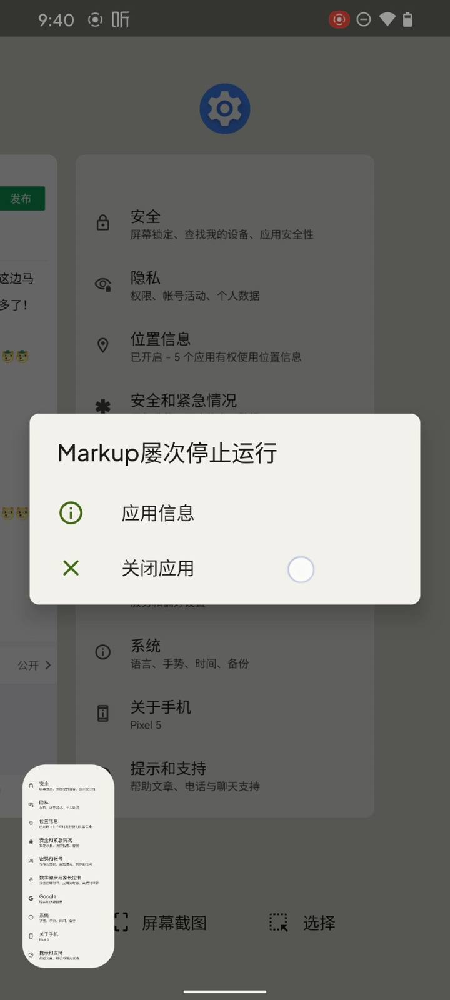
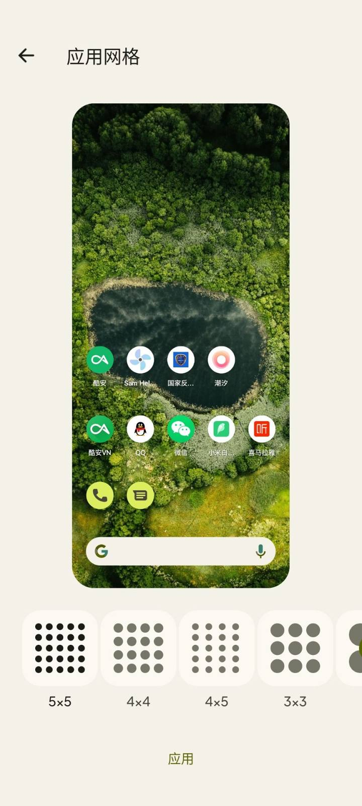
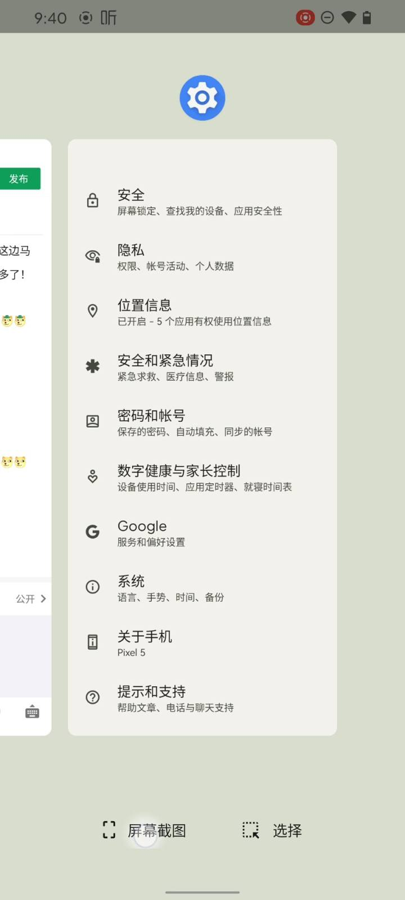
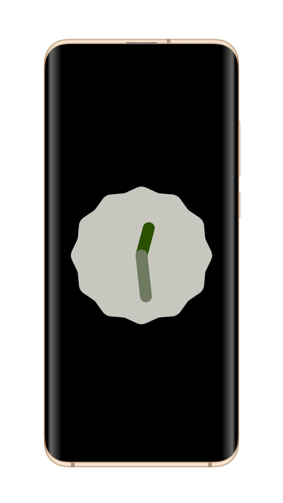

> 本文原发于 [酷安](https://www.coolapk.com/feed/30625172)（2021-10-11，机型：Google Pixel 5），现迁移至本站并本地化图片资源。文中体验基于当时系统版本，部分 bug 与适配情况可能已随后续更新变化。

等了半天，MIUI 安卓 12 还没上，结果黑台这边马上就来了！说实话，一上手，bug 和槽点太多了！那接下来聊聊这还热乎的安卓 12。

## 简介

1. 关于 bug（特性）
2. 系统 UI
3. 目前功能的完善程度
4. 总结

## 1. 关于系统 bug

首先第一点：截图后预览是会崩溃的。

还有它不能使用指纹进行解锁。QQ 也不能正常使用。解决办法是用 Play 版 QQ。

所以追求稳定的人就别日用了！

## 2. 系统 UI

可以说原生安卓的设计一直都很在线，这次还搞了一个「为你设计」的功能。它会随着壁纸变化，主题的颜色也会跟着变化。

但令人生气的是，谷歌直接把安卓都的通知栏和后台半透明给都不给了，直接不透明！

这次安卓 12 在动效上有了变化，上拉会有那种拉伸的效果……

## 3. 目前功能的完善程度

现在有了一个类似 MIUI 传送门的东西。这个东西提取照片就离谱——它是把 app 截图下来随后再裁剪。

这就产生了两个问题：

1. 无法清晰提取或者保存原图。
2. 没办法裁剪好。

这个只能希望谷歌适配 app 了！

## 总结

安卓 12 是不错，但在现在 app 尚未适配、系统 bug 并没完全修好，还有谷歌在国内的生态问题，都导致安卓 12「难用」。

现阶段只建议尝鲜，不建议日用。

加油，谷歌。

谢谢大家。
