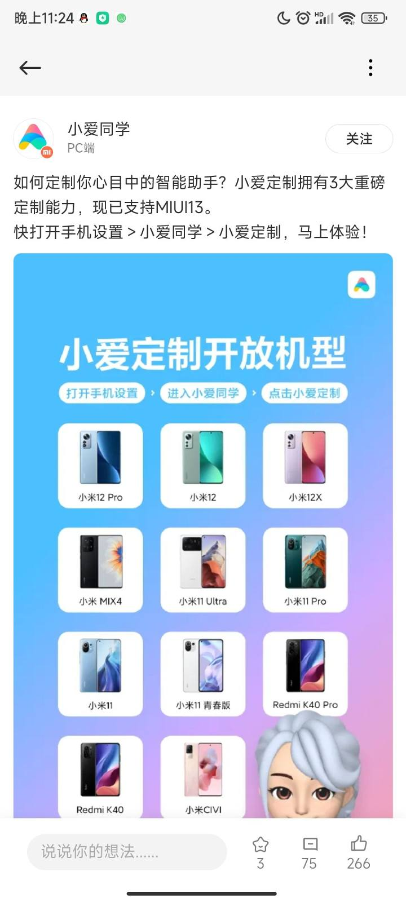
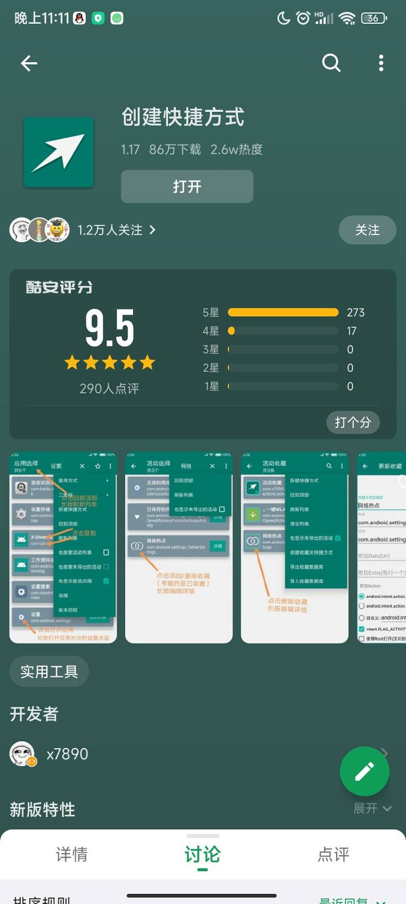
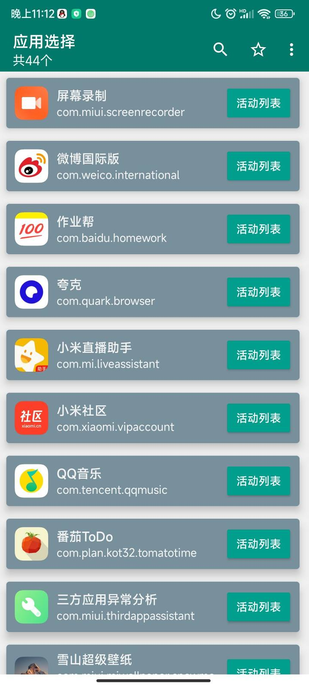
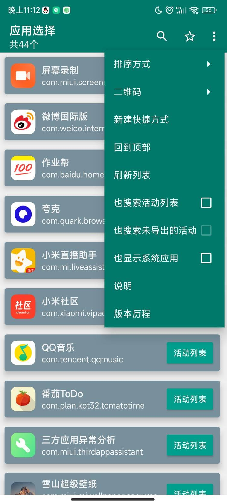
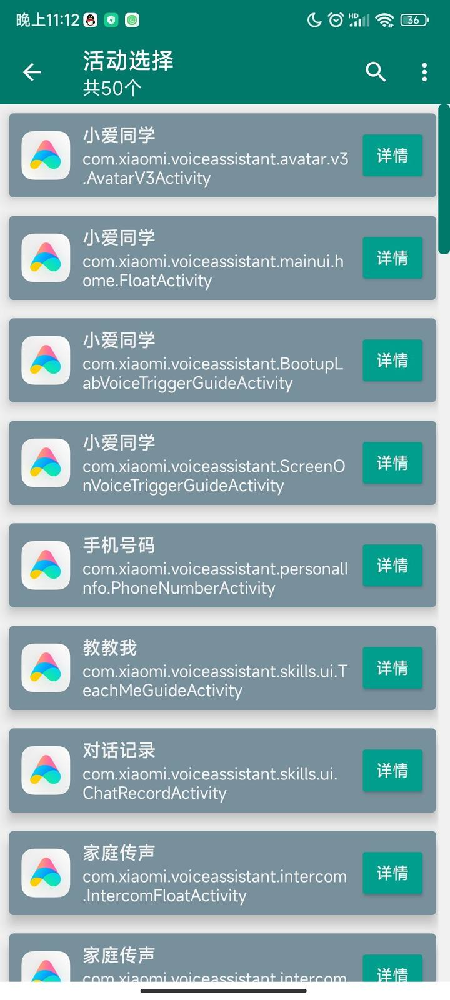
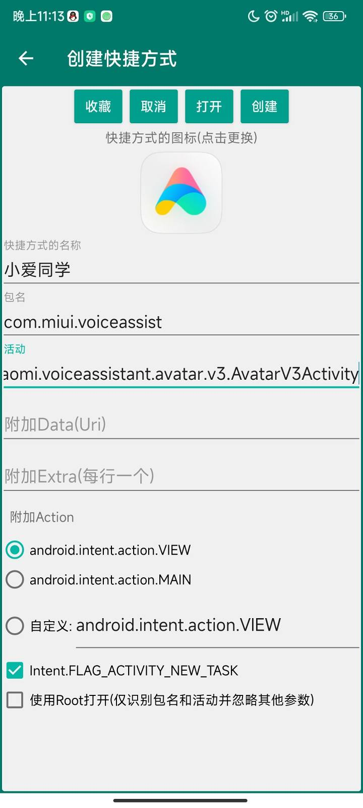
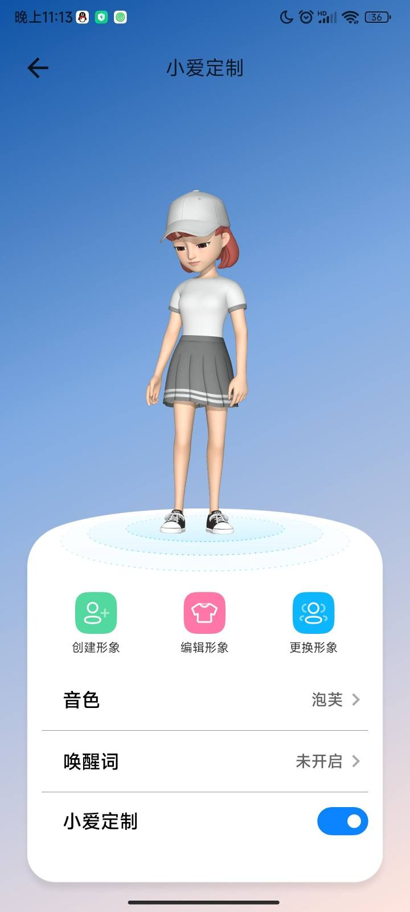
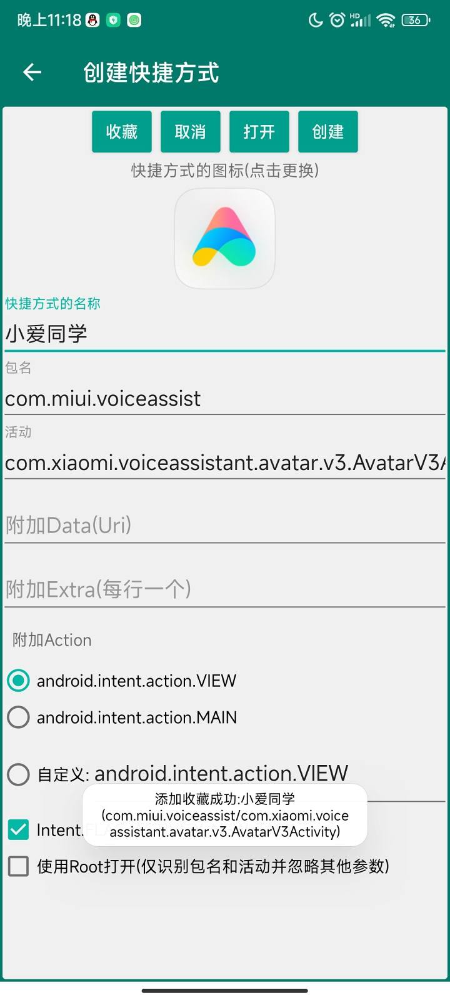

> 本文原发于 [酷安](https://www.coolapk.com/feed/32509495)（2021-12-31，机型：Redmi K30 Pro 变焦版），现迁移至本站并本地化图片资源。方法基于当时 MIUI / 小爱版本，后续系统更新后可能失效，请自行评估风险。

大家好我是小行星，看小米的动态搞得我火冒三丈。

小米是整得牛逼，我无语了，只有寥寥几个机型可以使用。

所以这里教大家强制打开小爱定制（自己摸索出来的）。

## 第一步：下载「创建快捷方式」

下载应用：[创建快捷方式](https://www.coolapk.com/apk/com.x7890.shortcutcreator)

## 第二步：安装并打开

下载、安装并打开应用。

## 第三步：显示系统应用并搜索

点击右上角三个点，并勾选「也显示系统应用」。

点击搜索按钮，搜索「小爱同学」。

## 第四步：打开指定 Activity

点击打开，选中 `com.xiaomi.voiceassistant.avatar.v3.AvatarV3Activity` 这一项。

也可以点击收藏，方便以后修改。

---

感谢收看此教程。

目前此方法不会产生任何 bug，不知是不是小米有意为之。
