> 本文原发于 [知乎专栏](https://zhuanlan.zhihu.com/p/511918936)（2022-05-10），现迁移至本站并本地化图片资源。部分外链、官网地址与第三方商店信息可能已过时，请以当前官方渠道为准。

## 1. 前言

随着原神 2.6 版本的更新，目前国服的审核环境越来越差。

## 2. 关于转国际服的利弊

第一是没有防沉迷系统，想不限制时间的孩子很友好。二来是没有莫名其妙的各种和谐，但值得注意的是国际服也是有视角和谐的，所以某些 LSP 就别想了。还有要注意的是国服与国际服的数据不互通，所以做好重新开始的准备。

以下为教程部分。

## 3. 下载并安装原神国际服

### 3.1 Windows 平台部分

PC 端其实较为简单，国内可以直接访问并下载。这边建议可以先改一下 DNS 加快访问速度。之所以那么做是因为国际服官网的服务器是架设在国外的，所以自然就慢。

#### 3.1.1 修改 DNS（可选；若想直接安装可跳过）

1. 右击 Wi‑Fi 图标。

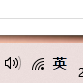

2. 点击打开「网络和 Internet」设置。

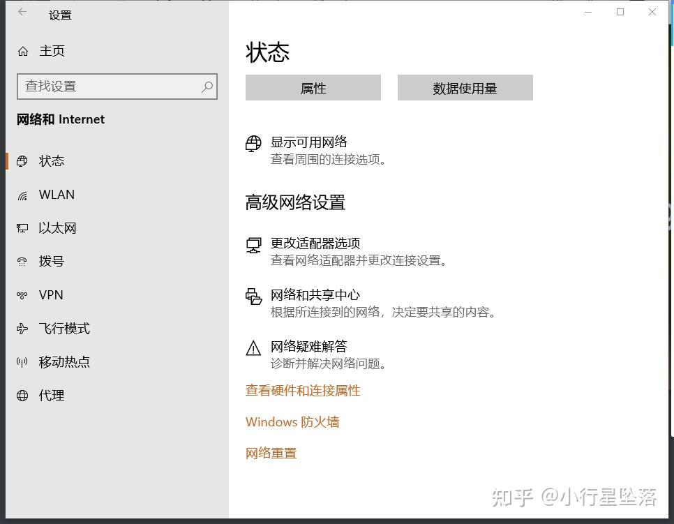

3. 单击「更改适配器选项」。

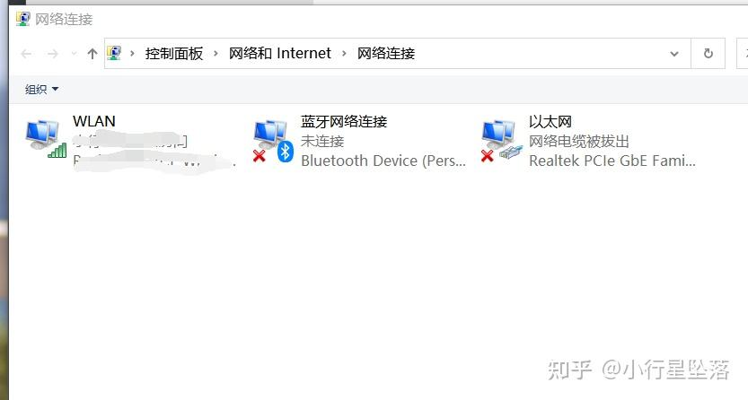

4. 双击第一个选项。

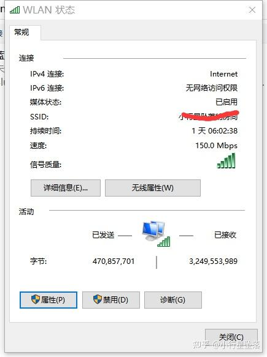

5. 点击「属性」。

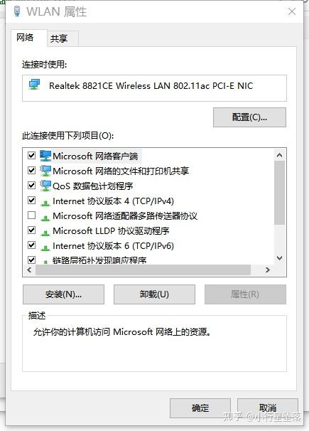

6. 双击「Internet 协议版本 4 (TCP/IPv4)」。

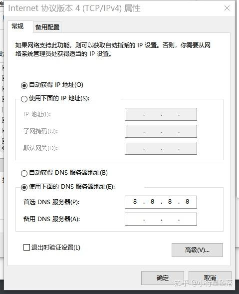

就像这样，再选择「使用下面的 DNS 服务器地址」，填入 `8.8.8.8`（谷歌的 DNS；如果有更好的 DNS 就填更好的）。

**腾讯云 DNS**

- IPv4：`119.29.29.29`

**114 DNS**

- IPv4：`114.114.114.114` / `114.114.115.115`

**Cloudflare DNS**

- IPv4：`1.1.1.1` 和 `1.0.0.1`
- IPv6：`2606:4700:4700::1111` 和 `2606:4700:4700::1001`

#### 3.1.2 下载原神国际服客户端

1. 打开浏览器，使用必应搜索 **Genshin Impact**，或打开官网：

   <https://genshin.hoyoverse.com/en>

   （文中旧链为 `https://genshin.mihoyo.com/en`，现多已跳转至 Hoyoverse。）

   注：如果打开太慢或根本打不开，就开一个加速器。（打开速度慢是正常现象，毕竟服务器架设在国外。）

2. 点击 **Download**。

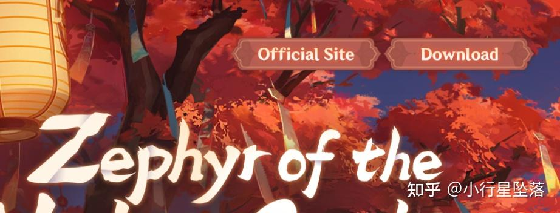

进入后页面上会有四个按钮，对应着各个不同的平台，我们只需要选择 Windows 平台就行了。按照提示进行下载操作即可。

3. **更改国服的快捷方式（可选）**

   如果你不想将国服覆盖掉，那就要把桌面上的「原神」重命名成「原神国服」。如果你没有安装国服那就没有必要了，直接跳到下一步。

4. 双击 `.exe` 安装包，并按照提示进行安装。

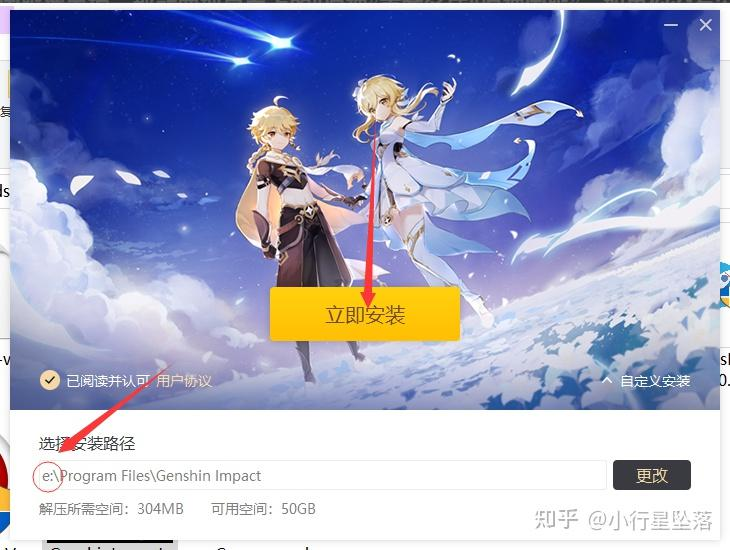

这里建议更改路径，如：`D:\genshinimpact`。如果有其他盘符则可以修改前面的字母「D」。（注意这个盘符必须拥有不少于约 70GB 的空间。）

5. 双击桌面上的「原神」快捷方式（注意图标底下写着 **HOYOVERSE** 的那个）。

打开就是这个画面：

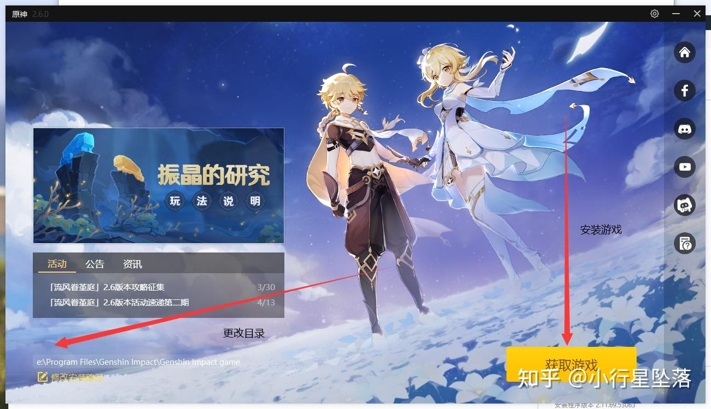

左下角可以修改游戏本体安装目录；右下角点击「获取游戏」即可安装。（还是不少于约 70GB。）

### 3.2 安卓平台部分（包括 MIUI / Flyme / EMUI / ColorOS 等）

注：这部分是安卓平台；要在 iOS 平台请直接跳转至 3.3 部分。以下演示使用的是基于 Android 12 的 MIUI 13 开发版，其他系统操作可能有些不同。

#### 3.2.1 开启开发者模式（非 MIUI 可跳过）

1. 打开设置 → 我的设备 → 全部参数（有的机型是「关于手机」）。
2. 连点 **MIUI 版本号**（注意不是安卓版本号）。这时开发者模式就打开了。
3. 退出到设置主页，点击「更多设置」。
4. 点击「开发者选项」。
5. 翻到底部，将「启用 MIUI 优化」关闭（无视风险提示继续 doge）。

#### 3.2.2 下载 QooApp 游戏商店

1. 打开浏览器。
2. 在搜索框输入（或直接访问）：

   <https://apk.qoo-app.com>

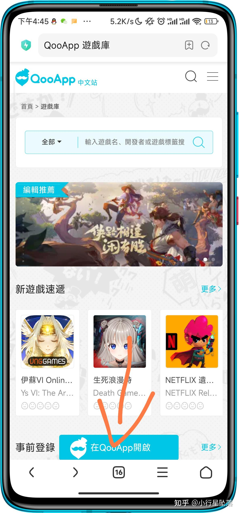

3. 点击下方按钮等待下载。

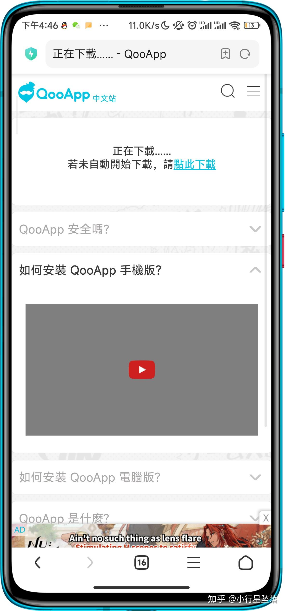

下载好以后按提示安装，安装完成后就会显示在桌面上了。

4. 打开以后将底下的「快捷登录」向左划。

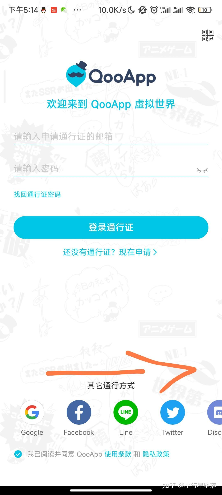

点击 **Guest** 选项。

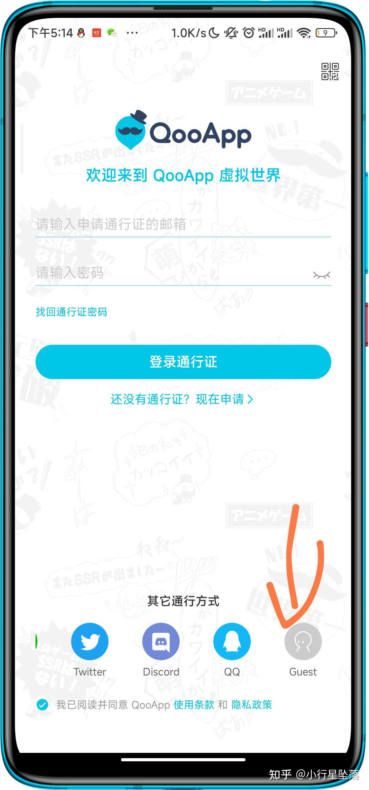

你就成功进入了！

#### 3.2.3 下载游戏客户端（非游戏本体）

1. 搜索 `genshinimpact`（「原神」的英文游戏名）。
2. 点击下载。

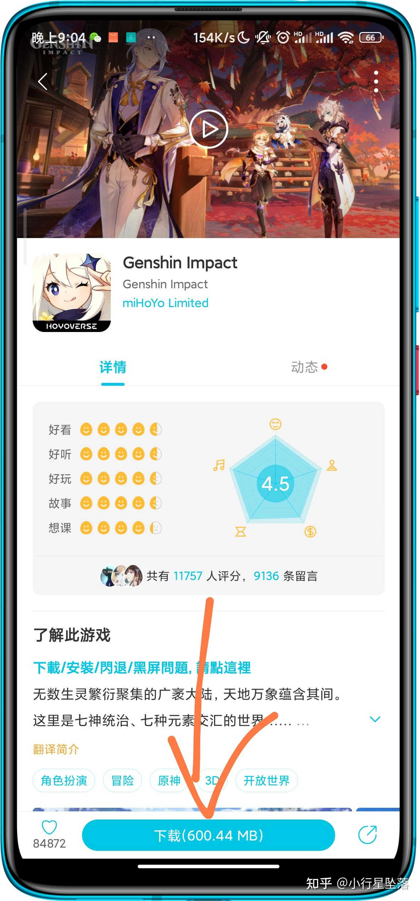

等待下载完成后按提示安装客户端。

注：如果你无法安装客户端，可以参照上文 **3.2.1** 部分。

### 3.3 iOS 平台部分

目前 iOS 平台的操作比较复杂，而且要重新注册一个 Apple ID。这里以日本区为例（部分图片来源于网络）。

#### 3.3.1 转区

因为我手上的苹果设备是借来的、不方便做演示，所以大家可以看相关转区教程，例如知乎上的「中国 Apple ID 转区」类文章（自行搜索最新有效方法）。

#### 3.3.2 安装

直接打开 App Store，像国服一样搜索 **Genshin Impact** 下载并安装就可以了。（注：不是中文的「原神」二字。）

## 4. 注册登录你的 Hoyoverse（忽悠宇宙）账号 / 通行证

首先米哈游的国内和国外通行证是不一样的，所有的数据都不互通。海外通行证使用电子邮箱（email），请先注册一个邮箱账户；具体方法因篇幅有限，请自行查阅。

（你问我为什么海外账号是忽悠宇宙而国内是米哈游？别问！问就是「原宇宙」doge。）

这一步需要懂一点英语，不会的可以用翻译。

### 4.1 注册账号

1. 打开网页：

   <https://genshin.hoyoverse.com/en/download>

2. 点击右上角的 **LOG IN**。
3. 再点击 **Register Now**。

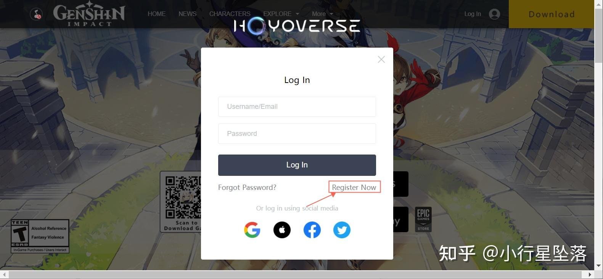

4. 填写你的邮箱、邮箱验证码、密码。

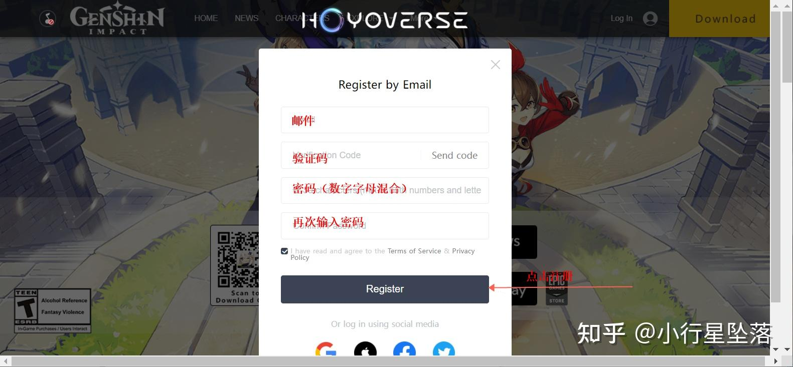

5. 注册完成。

## 5. 打开客户端并登录你的 Hoyoverse 通行证

打开原神客户端，并按照提示输入邮箱与密码。

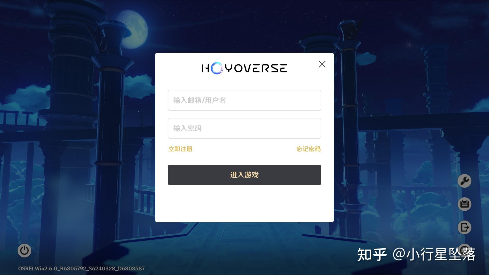

这里需要验证码（速度比较慢，要稍微等一会）。

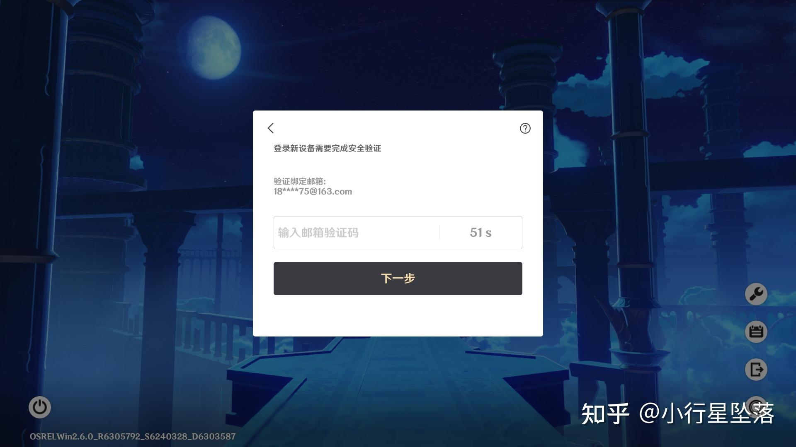

稍等片刻就登录成功了！

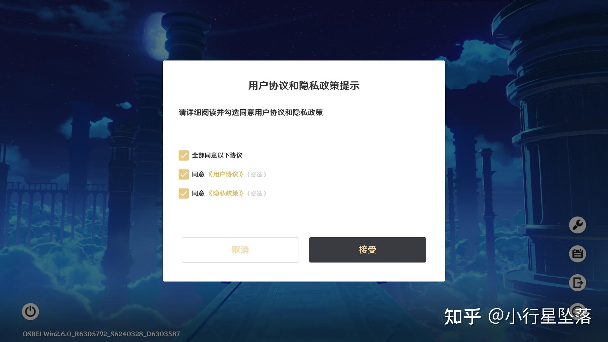

## 6. 选择服务器

这里有四个选项可供选择，分别是：

1. **TK / HK / MO**（港澳台服）
2. **Asia**（亚服）
3. **Europe**（欧服）
4. **America**（美服）

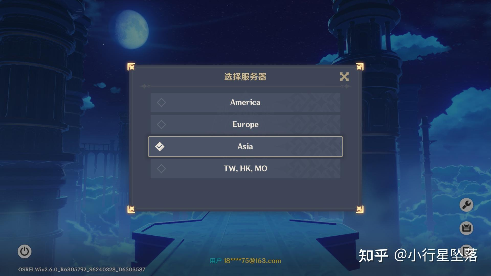

这里我推荐 **亚服**：服务器相对来说不远，网络也较为稳定，活动也比较多。其次是港澳台服，延迟最低，但可能因为地区比较小，一些活动会有所缺失。再其次是欧服，你可以与「歪果仁」交流。最不推荐美服，延迟超高，开加速器也可能无法正常游玩。

下面以亚服为例：

1. 选择你喜欢的服务器。

2. 点按屏幕中央的「开始游戏」。

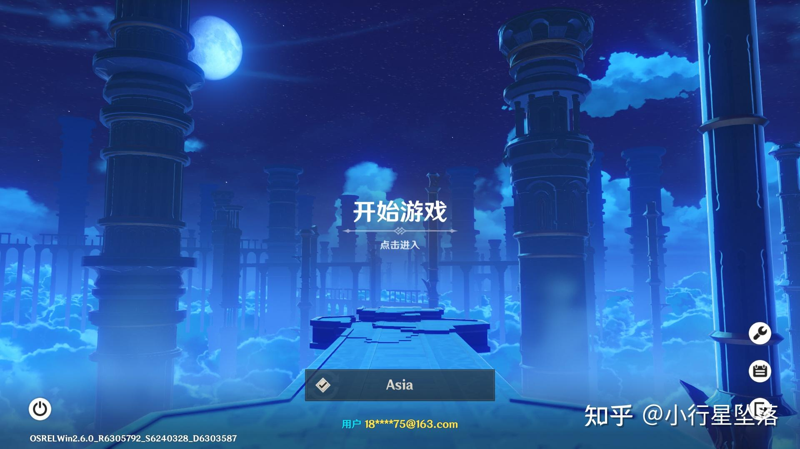

3. 等待下载（嘿！别来无恙啊 doge）。

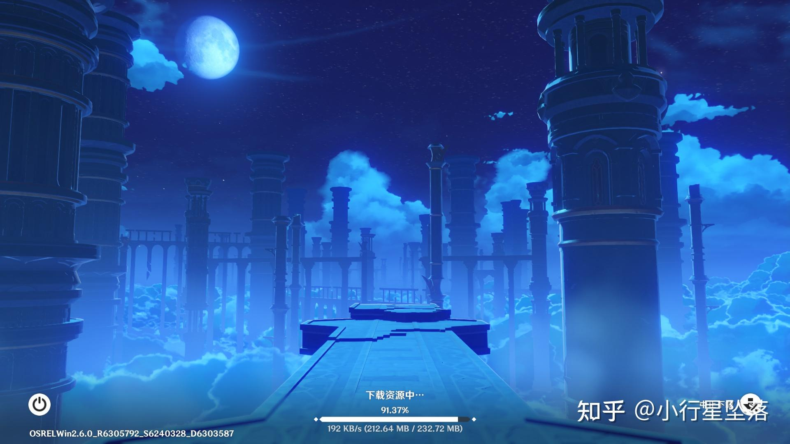

4. 进入游戏。

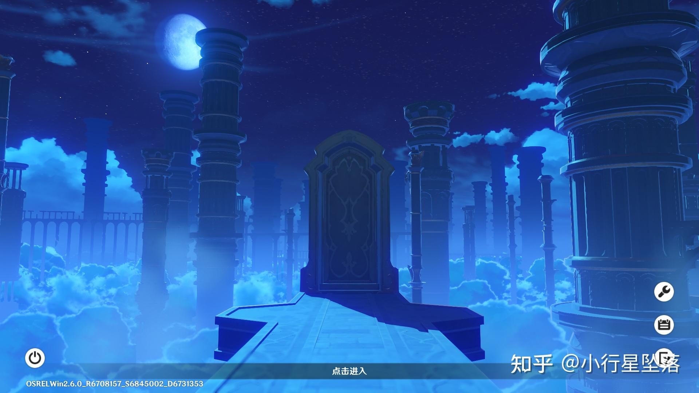

后面的操作就与之前国服没有区别了。

| 那么旅行者，开启你全新的旅程吧！ |

## 7. 关于延迟高的问题

这个一般就需要加速器了！如果你是电脑还连着 Wi‑Fi，尽量拉一根网线。

（以下不是恰饭，可放心食用。）

### 7.1 关于手机端加速器推荐

我用的是 biubiu 加速器：一点就是免费，而且也比较稳定。但注意电脑端是不免费的，仅限手机端！

## Q&A 问答区

### 1. 为啥注册时发的验证码，邮箱中找不到？

你去「垃圾箱」那一栏看看，可能系统识别为了广告。第二种就是网速慢，过一段时间刷新一次就行了。

### 2. iOS 转区后应用商店没有加速器怎么办？

你可以先在国区 App Store 里下载加速器，再转区下载原神。但如果你已经转区好了，就先下原神再转回国区下载加速器，效果是一样的。

### 3. 加速器要实名咋办？

按各加速器平台当前合规要求完成实名即可；不要使用他人身份信息。

### 4. 转国际服的优点、弊端

首先是氪金不太方便，通常需要 VISA 等国际支付方式，也可以找人代充，或者找有索尼主机的小伙伴借来绑定一下再充值。还有就是被盗号后相对更难找回，但如果你有定期换密码的习惯，那也没问题。

其实说实话，国际版最大的优点就是没有离谱的实名 / 防沉迷限制；如果不在周末的晚上玩原神，国际服可能会是你更舒服的选择。

### 5. 国际服有类似米游社的社区吗？

还真有！叫 [HoYoLAB](https://www.hoyolab.com/)（译名：忽悠实验室），唯一的问题就是米哈游做了锁区。

## 写在文后

这期教程肝了将近半个月。希望大家觉得有用；我们来日再见！

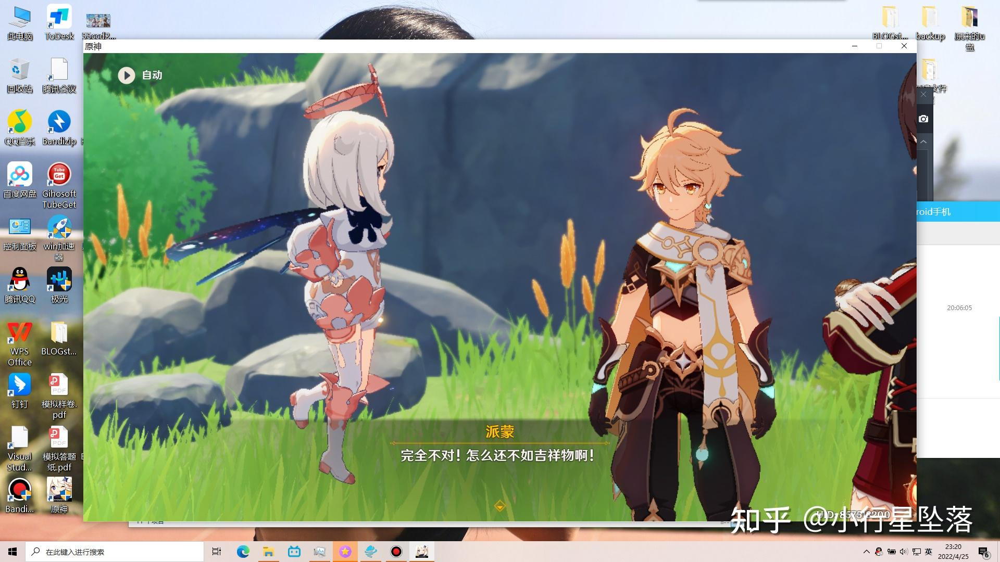

## 参考文献和图片来源

1. 《2020 国内外免费公共 DNS 服务推荐》（知乎）作者：@Tiry
2. 文章截图 作者：@小行星坠落
3. 封面（原图）作者：@原神 / © miHoYo
