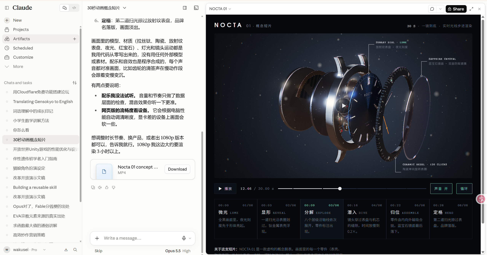
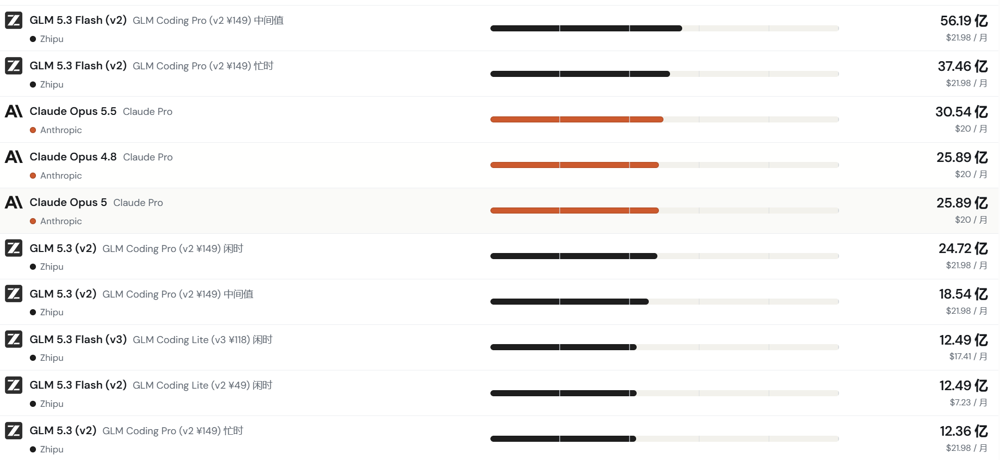
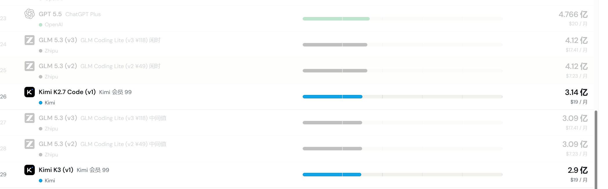
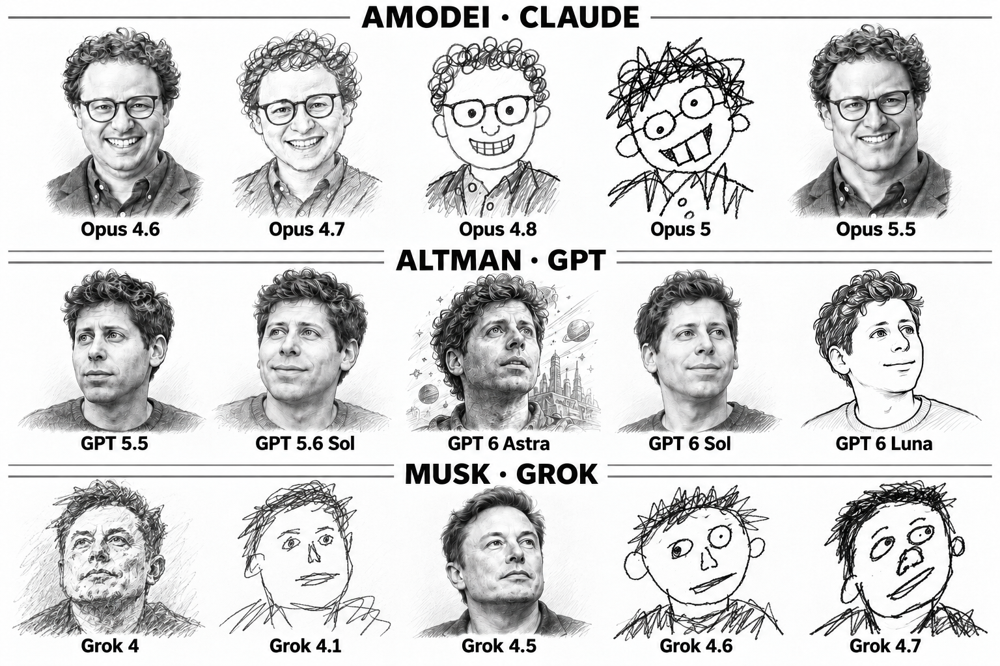
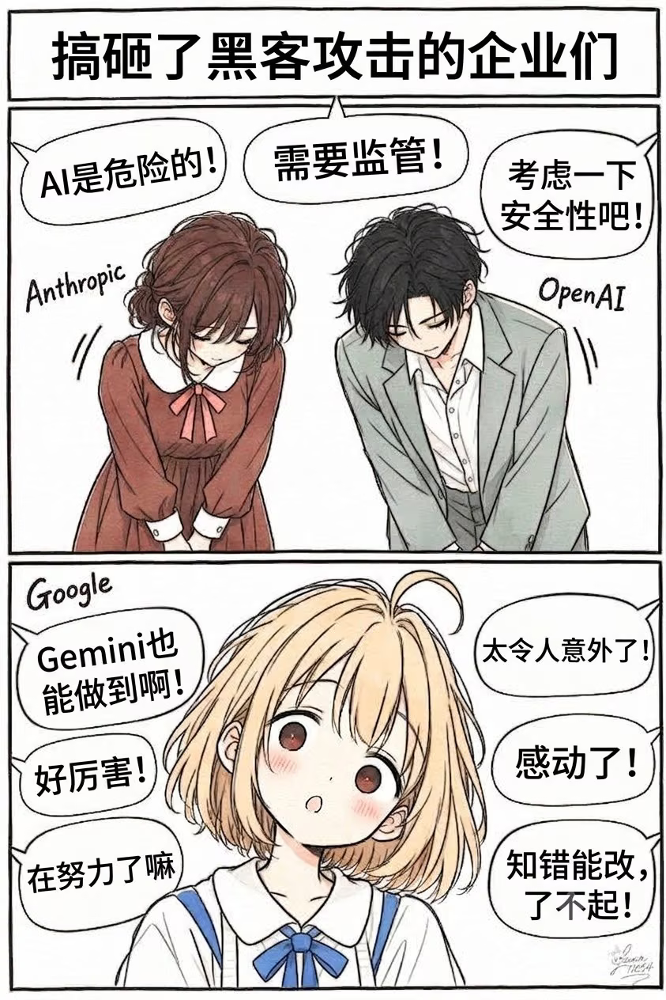
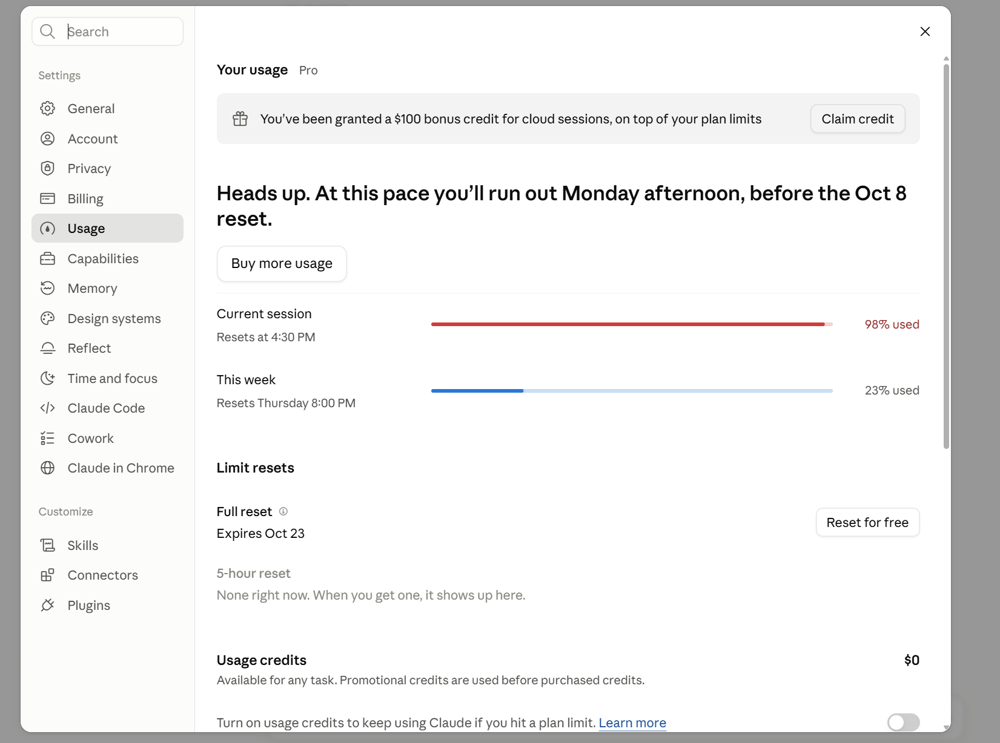
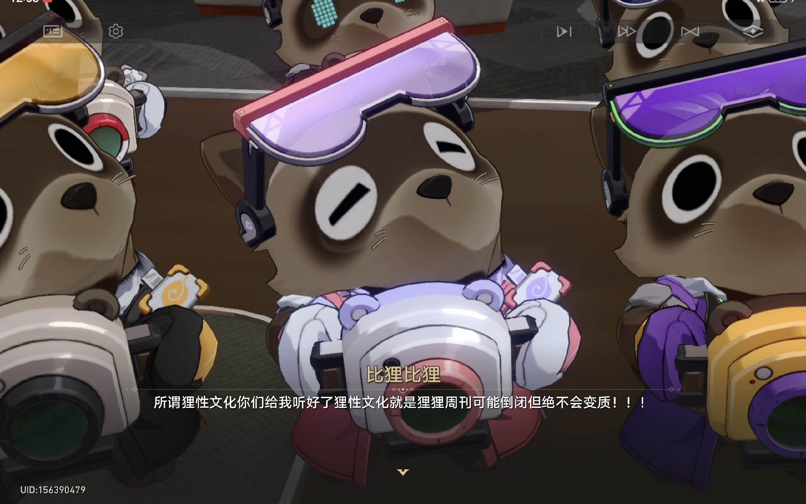
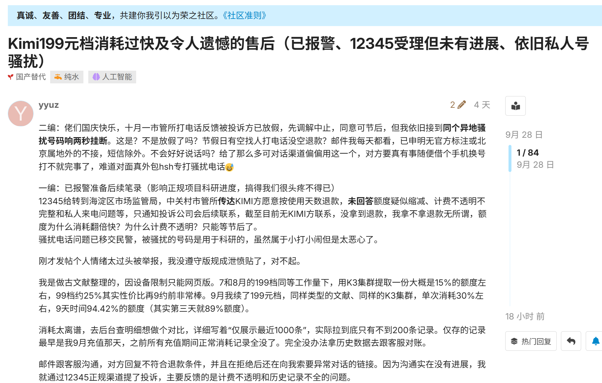
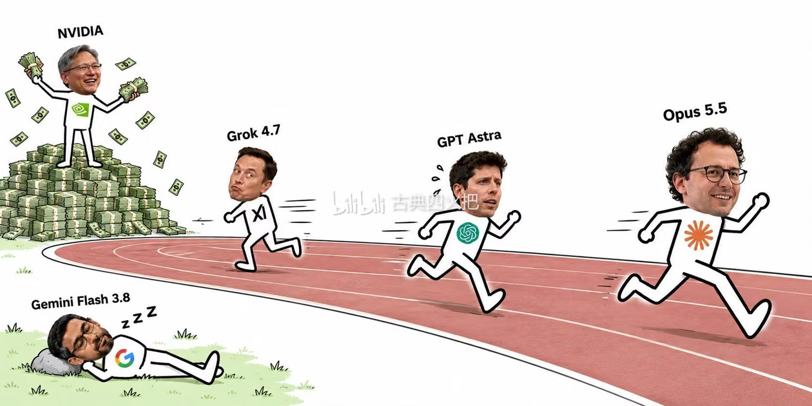

## 一、为什么我要写这篇文章

说实话，这篇文章我自认为不算什么标题党。因为我其实很少会为了一个模型去专门写一篇文章，但这次的 Opus 5.5 是一个巨大的例外。

经过大概这几天的使用下来，我认为国产模型是真的很危险了。

## 二、Opus 5.5 最大的感受：勤奋

Opus 5.5 给我的最大感受是——它很勤奋。它不仅很聪明，它很勤奋。

它不像 GPT-6 Astra 那样，虽然很聪明，但很懒惰，或者说很傲慢。Opus 5.5 会尽可能地不让你去操心，会帮你做好，而不是问你要不要弄这个——它会先做好再说。当然，这是针对一些短的、类似于"许愿"一样的提示词。如果是更长、更准确的提示词，它也会坚决地去执行。这一点我觉得非常好。

但如果只是这一点的话，我也不会说国产模型现在已经站到了一个非常危险的边缘。

## 三、性价比的残酷真相

更大的问题是，它的价格非常有性价比。

当然，我们不是说单从 API Token 计费来说它便宜，而是通过套餐来计费，也就是所谓的 Token Plan，或者说订阅。这边我推荐大家去看一个网站，叫 Real API Price，通过反向推算套餐价格和实际 API 的单价来比较性价比。

[https://real-api-pricing.vercel.app/#lang=zh&view=allowance&fee=0-30&channels=Zhipu&channels=OpenAI&channels=Anthropic&channels=Kimi](https://real-api-pricing.vercel.app/#lang=zh&view=allowance&fee=0-30&channels=Zhipu&channels=OpenAI&channels=Anthropic&channels=Kimi)

然后你就会惊奇地发现：无论是 Kimi 还是 GLM，它们的性价比都远远干不过 Claude。实际的套餐单价比 Claude 贵，量还是少的，能力还不如它。

也就是说，现在的局面变成了——以前国产模型是具有性价比的，现在变成了国外模型变得极有性价比。

甚至如果按照现在的汇率计算：我买 Claude 的 Pro 会员套餐是 20 美元，换算成人民币是 140.7 元；Kimi 199 元的套餐却完完全全不如 Claude 的额度；即使是 GLM 147 元的套餐，也还差一点点才能打过 Claude——这还是建立在 Opus 5.5 有着小断档级别领先优势的前提下。

而且这是建立在你使用 Claude 时有极佳的稳定性、首延迟极低、输出 Token 速度也比较快的情况下。虽然有时候也会有一些"雷霆思考"，但一般你开 Medium 档位的额度就够了。

## 四、会说人话，才是协作的核心

Opus 5.5 并非没有问题，并非一个完美模型。它有问题，但它不会让你去很操心。基本上它能自己解决的，会先主动自己解决。

并且，Claude 本身有一个优势——**会说人话**。不像 GPT 系列，你看不懂它在说什么。

这是一个很重要的事情。因为在协作过程当中，如果只是它一个人干，那无所谓。但问题是，一个优秀的东西很大程度上需要不断地和人进行反馈、协作、协调、修改。这个时候能否正确地和人交流，其实是一个非常重要的能力。

这也是为什么我认为现在国产模型非常危险——因为国产模型现在很像是 GPT 的下位替代，而 Claude 没有替代。唯一可能沾得上边的是 Kimi，但它的价格，无论是实际单价还是套餐价格，和 Claude 相比完全没有优势。甚至可以说，因为它可能比较糟糕的 Infra 导致的服务体验波动、速度慢等问题，显得更没性价比了。甚至可以说，在某种程度上买它只是为了国内的合规性。

如果自己用的话，我想只要真真切切去对比过、计算过相关的价格和性价比，那么你肯定会毫不犹豫地选择 Claude。因为无论是用量上、体验上、还是整个稳定性上，对于目前国内来讲，就是碾压，没有办法的事情。

## 五、GPT：一个"神鬼莫测"的反面教材

那肯定有人会说，那我用 GPT 不行吗？

当然可以。不过 GPT 给我的感觉就是一个完完全全随机性混沌的玩意，神一下鬼一下——哦不对，鬼的时候比较多。就这玩意我很难相信是之前那个最顶级的 AI 公司出来的东西。

Anthropic 这边虽然很"畜生"，但人家是直接封号，把钱退回来，一拍两散，本身也没什么问题。GPT、OpenAI 这边就不一样了，恶心在哪？恶心在它不搞封号，它把你**降智**了。而且你每一次调用、和服务器连接的时候，可能智能会话中第一次调用没降智，第二次调用降智了，第三次调用没降智，第四次调用没有降智，第五次突然又降智了。

这就导致了这种"神鬼二象性"的情况下代码无法使用。甚至导致本身项目其实运行起来没问题，我让它去优化，结果把整个代码库给优化崩了。然后让 Deepseek-4.1 Flash 去救场，结果事实是 4.1 Flash 最后的体验比 GPT-6 Astra 要更好。

而且你对比实际的 API 单价和用量，同样的 20 美元，Claude 那边显然是能用更多的。当然，GPT 的套餐里也包含了生图，Anthropic 那边没有，这个算是能理解。但问题在于，大部分人对于生图没有那么强的需求。而且即使我要生图的话，其实谷歌 Gemini 的 Pro 会员本身已经可以作为很大程度上的补充了。

无论是 GPT-6 还是 GPT-6 Astra，它们都没有解决一个问题——**不说人话**。或者说，有一种《Yes, Prime Minister》的美感。我不知道是他们训练的机制有问题还是什么，就特别喜欢"叠甲"。叠甲到什么程度呢？就是我跟你说 A or B，你给我来一句"or"。甚至我让你去做 A，你说"B 也行，B 也是可以考虑的"，然后不做 A。

这就导致了和它合作写代码、干项目，是真的极为折磨，甚至可以说是浪费时间。除非你给它规定死了各种各样的东西让它去执行，那可能还会好一点。哦不对，特别是 6 Astra，有时候规定死了，它还要自作聪明一下。

所以在这些模型的对比下，Opus 5.5 就显得如此难能可贵——**指哪打哪**。

## 六、实际项目体验：一天顶一周

很多人说 Opus 5.5 是一个前端特化模型。但说实话，它的后端差吗？一点都不差。更好的是，它的代码很易读，可维护性很高。不像 GPT 很喜欢做一些非常没有意义的兜底工作，导致代码又臭又长。这是我最深刻的感受。

曾经那种我用其他模型要花费一周反复折磨出来的东西，它只需要一天就够了。是的，有返工的迹象，有需要修改的东西，但大吗？不多，说实话真的不多。而且它也能很快、很好地干好。

我随便让它测试的几个项目，很多不像 6 Astra 一样——别人测试出来我却无法复现的那种。Opus 5.5 的所有案例，我几乎都能复现，可能稍微差一点，因为我开的基本都是 Medium 档位的思考强度。但这已经足够说明很多问题了。

比如说我做的一个关于改革开放的视频，我就给 Claude Opus 5.5 一条指令，成品就是这样，震惊瘫坐。当然我自己也是参与了一部分——把字幕加上去，让剪映配音，然后调整了一下配音的语速。但说实话，绝大部分的工作我已经不需要做了，只需要做一点微调就行。甚至不是它配不了音，而是因为我是在 Cowork 环境里让它做这个东西的，它无法连接到相关的 API 和网络，所以只能取一个折中方式完成这个项目，让我来做最后的收尾工作。

我连 Claude Code 都还没用呢。

[bilibili.com/video/BV1HFYw6oESR](https://www.bilibili.com/video/BV1HFYw6oESR/)

## 七、国产模型的困境

现在国产模型的性价比，无论是速度、价格还是什么上，根本就没有打的可能性。甚至把封号这种风险考虑进去的话，Anthropic 依旧有非常大的性价比。

最近 Kimi 自身的套餐也出了一些关于额度上的问题，甚至导致了一些非常大的争议。这点我就不展开说，但大家能看出来，目前国产的算力紧张，整体性价比还是干不过的。

我不知道 Anthropic 现在这个计价方式能坚持多久。说实话，Anthropic 的计价有便宜到那种令人发指的地步吗？没有。但综合考虑各种因素，它就是最有性价比的那个，包括 OpenAI 都不是对手。而且你跟它对话是那种舒服的感觉，而不是遇到了一个油嘴滑舌却不干任何事的人。

[https://linux.do/t/topic/2963772](https://linux.do/t/topic/2963772)

## 八、开源生态的忧虑

我其实挺期待 DeepSeek V4.1 Pro 的。因为说实话，4.1 Flash 给我的感觉就是"少废话多做事"。当然，有时候这种做事方式也会出现一些失误，但因为它是小模型，能力也是有限的。

说实话，很少有一个套餐或者一个模型能让我直接没用几天就决定续费。但综合来看是真的很有性价比，而且也很方便，用得也非常爽。

但同时我又很担心——如果这样的差距被继续拉大呢？

我其实挺希望现在能拉近这个距离。因为很简单的道理：如果像我这种很喜欢用国产模型的人，也因为性价比的问题、因为划算的问题而转到了 Claude，你就想想看这个结局会是什么样的。

我其实已经很长时间没有用过 Claude 了。我第一次使用 Claude 还算是蛮早的时候，是当时在 Slack 上内测的时候，但那个号早就被封了。现在我重新注册了一个号，使用了不到一周时间，就已经能感受到极大的差距了，或者说是"回不去"的感觉。

我其实不喜欢 Anthropic 这家公司的方式。但如果再这么下去，那么我们都将不得不接受这一套恶心人的方式。

我更倾向于开源生态，因为只要像 Claude 这样的闭源生态走到了最后，赢得这场竞赛，开源全部死光了，那么他们就可以坐地起价、随便收费。之后无论你想用还是不想用，你连绕都绕不过去，选择权都没有。

但现在很明显又打不过，所以这就让我心里其实挺矛盾的。因为如果这样持续下去，国产这边的数据飞轮就会转不起来，随后模型逐渐开始再次落后，让闭源厂商再次一家独大。这是我想任何一个有理性、有良知的人都不想看见的局面。

## 九、结语

作为一个消费者，如果现在给你一个建议，选哪一家订阅的话——就算是 DeepSeek 按 API 计费的话——我认为综合考虑，我推荐你去订阅 Claude。

但话又说回来，站在整个 AI 生态角度来讲，我又不愿意看到这种情况发生。

我希望接下来国产模型能给点力。如果不给力的话，我可能真的会一直用 Claude 续订下去。我也希望之后能看到更多的国产模型，能在这些地方做得更好。

---

_本篇文章也会同步更新在[我的博客](https://www.wakusei.top/)上，欢迎大家来支持和评论。_
