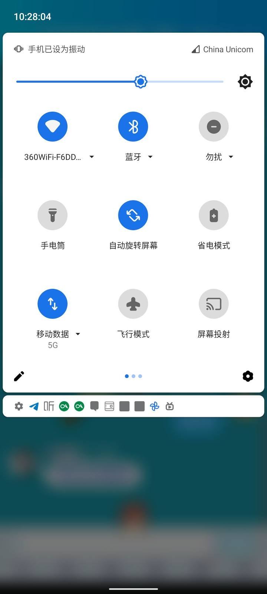
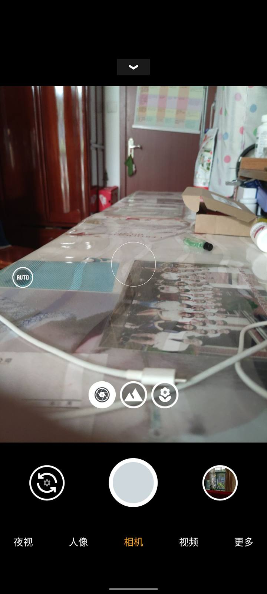
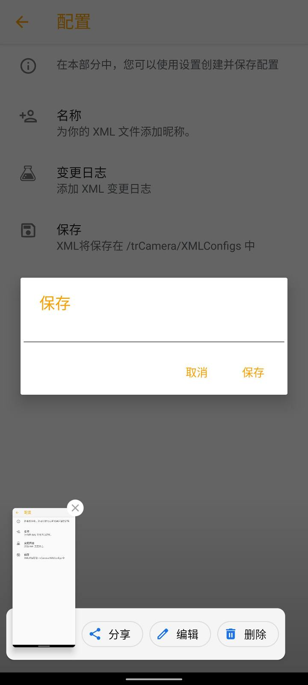

> 本文原发于 [酷安](https://www.coolapk.com/feed/28420026)（2021-07-14，机型：Redmi K30 Pro 变焦版），现迁移至本站并本地化图片资源。文中体验基于当时 ROM 环境，部分结论可能已随系统迭代变化。

大家一听到类原生这个词就会想到：简洁、流畅、快速。

但其实类原生可以说它是个毛坯房，你需要自己给它装修。无论是功能，还是省电调度，都必须自己去调整。

## 1. 谷歌服务

说句实话，谷歌服务真的不错。但难用就难用在你每次都得开 VPN，就很烦。

而且会遇到各种问题，比如时不时的白屏、网络假死等。

当然，谷歌服务在国外体验是相当好的。但在谷歌没有回归中国之前，一切都是白搭。

## 2. 生态简陋

可以说，没有谷歌服务的类原生，连毛坯房都不如。

甚至有些 ROM 连相机和浏览器都不自带，即使内置了也是非常垃圾的那种，只能用来下 Chrome。（再 Chrome 我没说。）全部都要你自己去下安装。

把设置折腾完，好多人都可以劝退了。

## 3. 关于云服务

说句老实话，MIUI 虽然 bug 多，但云服务做的都不差。可以说，你刷机过后，你的照片还可以干干净净地躺在相册中。这样子是几乎无感的。

大佬的备份脚本你也不会用。结果导致你还是回到了 MIUI。

## 4. 关于省电

首先，我自己是重度手机使用者。续航时间反而比 MIUI 低（ArrowOS）。我想着不可能啊。

结果我在群中问了大佬，人家回答：用灭霸压后台。

我说：我不会用咋办？

大佬：那就没办法了。

像我一样的小白，直接可以蒙了。

现在我用 Arrow，一天三充少不了。用 MIUI 时，也就一天一充。

而且不看了下内核：YC 调度？就离谱？

## 5. 拍照

刚才不是说了吗，很多类原生内置的拍照软件很垃圾。

这时候曲线救国的办法只有下载谷歌相机。但这一步，又有很多像我一样的小白用户犯难了。

为啥打不开长焦？为啥不能开超广角？

然后这个折腾了半天，又被劝退。

我倒是最后给它研究明白了，要有一个配置文件，还要给它安装进去。

## 总结

不爱折腾，就千万不要刷。

用到最后，我总算明白了那句「千古名言」：

**愿你刷机半生，归来还是 MIUI。**

突然发现 MIUI 与我的生活和使用习惯已经绑定了。我们已经离不开了 MIUI 的各种功能。

想想还挺可怕的。

第一次写图文，希望大家多多支持。有什么疑问可以留言告诉我。

bye.
